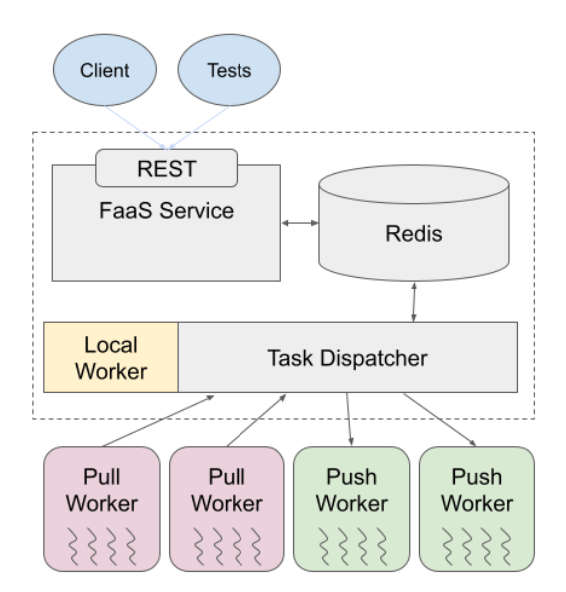

# Distributed FaaS System

# Project Overview

  In the realm of distributed systems, our Function as a Service (FaaS) system, named Distributed FaaS System, offers an intricate and resilient architecture for streamlined task execution and processing. Comprising a client, server, task dispatcher, push workers, and pull workers, this system is designed for enhanced efficiency, fault tolerance, and adaptability.




# Testing

## Introduction
  This project aims to automate all testing. Thorough automated testing ensures a quality product and dramatically enhances maintainability by providing confirmation of the accuracy (or inaccuracy) of changes. It also presents the functionality of a system in a declarative way, making the system easier to understand. To this end, we have developed integration tests and fault tolerance tests which rigorously verify the robustness of our system.

## Instructions
To run the tests included in this project, follow these steps:
1. Ensure you have set up the virtual environment for this project by running the setup script in the project root: 
~~~
$ chmod +x ./setup.sh && source ./setup.sh
~~~
2. Run the integration and fault tolerance test suite:
~~~
$ ./test.sh
~~~
3. Alternatively, spinup the system for a given mode and worker count, and run the integration tests through ```pytest```:
~~~
$ ./start.sh -m <local|pull|push> -w <int>
$ pytest tests
~~~

## Integration Testing
- ```test_web_service.py```: Perform basic checks on the interactivity of the system. They verify that the REST API endpoints of our web service are responsive, and that the system allows function registration, execution, status retrieval, and results retrieval.
- ```test_long_running.py```: Ensure that long running tasks do not fail or are somehow lost. These tests are especially useful for fault tolerance testing, since it is guaranteed that some of our workers will be processing these tasks when they are killed. We are thus able to verify that our task dispatcher is able to correctly identify stale workers and redistribute the tasks that were assigned to them.
- ```test_high_volume.py```: Verifies our system is resilient to high request volume, and does reject requests or lose requests.
- All tests ensure the web service endpoints return HTTP status codes of 200 or 201.
- ```test_log_running.py``` and ```test_high_volume.py``` use a variety of function signatures and function features to show our system can handle these python features. ```mult``` uses multiple positional arguments, ```concat``` uses both positional and required keyword arguments, and ```matmul``` imports the ```numpy``` package to ensure using functions from non standard packages work properly (the packages do need to be installed where the workers are running though).

## Fault Tolerance Testing
- ```test.sh```: For each mode (push and pull),
  - Launches all components of the system using ```start.sh```
  - Launches ```kill.sh``` in the background
  - Runs all integration tests against the system
- ```kill.sh```: 
  - Sporadically chooses victim workers at random, and kills the process
  - The script then waits for a short period before restarting the process it just killed. The goal is to simulate sporatic hardware or network outages, and verify that our system is able to recover gracefully from these failures.
  - After a predefined period, the script kills the task dispatcher, sleeps for a period, then restarts the task dispatcher. Workers are not the only component which can fail, our system needs to be able to recover from failures in the task_dispatcher as well, without losing any tasks.
  - After an even longer predefined period, the script kills all workers, sleeps, then restarts them. The resilience of our system should not depend on at least one worker being alive.
 
## More Information
  Check out the report directory.

